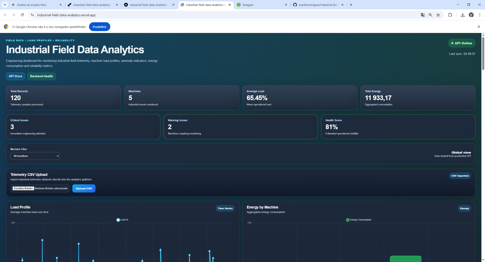
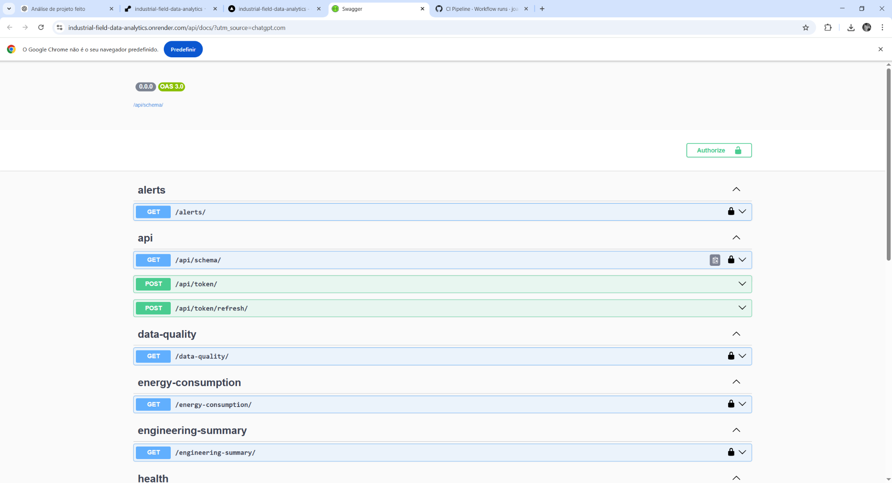

# Industrial Field Data Analytics Platform

Production-ready industrial analytics platform built with Vue.js, Django REST Framework and PostgreSQL for monitoring telemetry, machine load profiles, reliability metrics and operational anomalies.

---

# Live Demo

## Frontend
https://industrial-field-data-analytics.vercel.app

## Backend API
https://industrial-field-data-analytics.onrender.com

## Swagger Documentation
https://industrial-field-data-analytics.onrender.com/api/docs/

---

# Project Overview

This platform simulates a modern industrial engineering analytics environment capable of:

- Monitoring machine telemetry
- Detecting anomalies
- Processing industrial CSV datasets
- Calculating reliability indicators
- Aggregating energy consumption metrics
- Managing engineering KPIs
- Providing JWT-secured API access
- Deploying cloud-native services

The project was designed with a real-world engineering dashboard architecture mindset using modern full-stack technologies.

---

# Screenshots

## Dashboard



---

## Swagger API Documentation



---

## GitHub Actions CI Pipeline


---

# Core Features

## Industrial Telemetry Dashboard

- Real-time engineering KPI visualization
- Machine load analytics
- Reliability monitoring
- Operational health indicators
- Energy aggregation charts
- Machine filtering

---

## CSV Telemetry Upload

- Upload industrial telemetry datasets directly from the frontend
- Automatic backend ingestion
- PostgreSQL persistence
- Dashboard auto-refresh after upload

---

## JWT Authentication

- Secure token-based authentication
- Access token + refresh token workflow
- Protected API architecture
- Swagger JWT integration

---

## REST API

- Django REST Framework backend
- Structured analytics endpoints
- Swagger/OpenAPI documentation
- JSON-first architecture

---

## Cloud Deployment

### Frontend

- Vercel deployment
- Production CI/CD integration

### Backend

- Render deployment
- Gunicorn production server

### Database

- PostgreSQL cloud database

---

# Tech Stack

## Frontend

- Vue.js
- Chart.js
- Vite

## Backend

- Django
- Django REST Framework
- drf-spectacular
- SimpleJWT

## Database

- PostgreSQL

## DevOps / Cloud

- Docker
- GitHub Actions
- Vercel
- Render

---

# API Endpoints

| Endpoint | Description |
|---|---|
| `/health/` | API health monitoring |
| `/machines/` | Machine inventory |
| `/machine-load/` | Machine load analytics |
| `/load-profiles/` | Load profile visualization |
| `/energy-consumption/` | Energy aggregation |
| `/reliability/summary/` | Reliability indicators |
| `/alerts/` | Operational alerts |
| `/data-quality/` | Data quality metrics |
| `/engineering-summary/` | Engineering KPI summary |
| `/upload-csv/` | CSV telemetry ingestion |
| `/api/token/` | JWT authentication |

---

# Local Development

## Backend

```bash
cd backend

python -m venv .venv

# Windows
.venv\Scripts\activate

pip install -r requirements.txt

python manage.py migrate

python manage.py runserver
```

---

## Frontend

```bash
cd frontend

npm install

npm run dev
```

---

# CI/CD Pipeline

GitHub Actions pipeline automatically performs:

- Backend dependency installation
- Django system validation
- Frontend build validation
- CI verification on push/pull request

---

# Architecture

```text
Vue.js Frontend
       ↓
Django REST API
       ↓
PostgreSQL Database
       ↓
Cloud Deployment (Vercel + Render)
```

---

# Engineering Analytics Concepts

This project includes concepts commonly used in industrial engineering and operational analytics environments:

- Telemetry ingestion
- Reliability monitoring
- Load profile analysis
- Energy consumption aggregation
- Data quality monitoring
- Operational KPI dashboards
- Cloud-native API architecture

---

# Future Improvements

- Azure deployment
- Azure PostgreSQL
- Azure Static Web Apps
- Databricks integration
- PySpark processing pipeline
- Predictive maintenance models
- Real-time telemetry streaming
- Role-based access control

---

# Repository Structure

```text
backend/        Django REST backend
frontend/       Vue.js frontend
sql/            SQL scripts
etl/            ETL processing
databricks/     Future Databricks integration
docs/           Project documentation
```

---

# Author

João Domingues

Industrial engineering analytics platform developed for full-stack engineering and data analytics portfolio purposes.